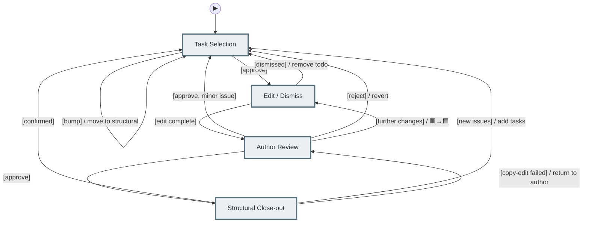
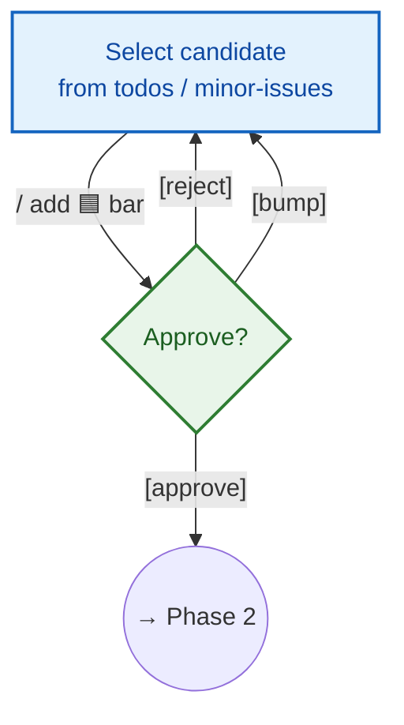
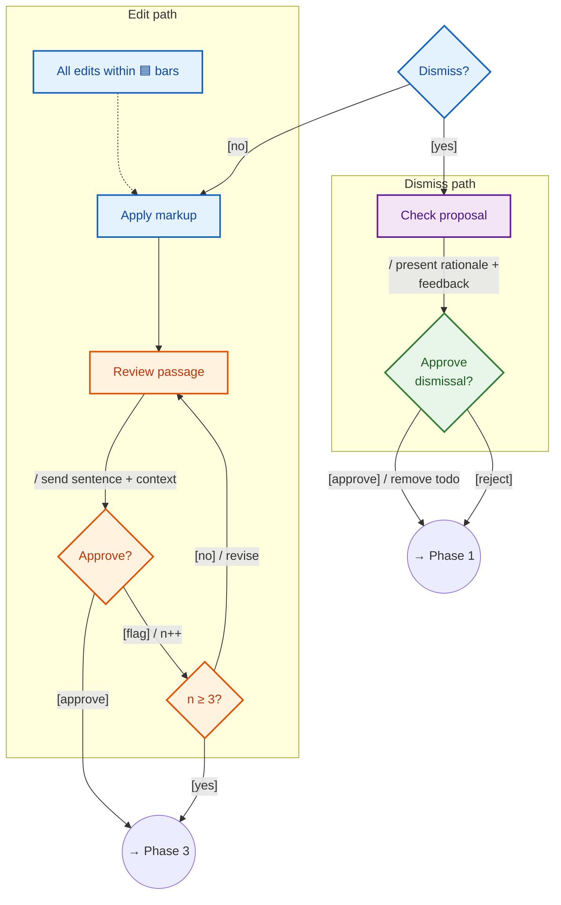
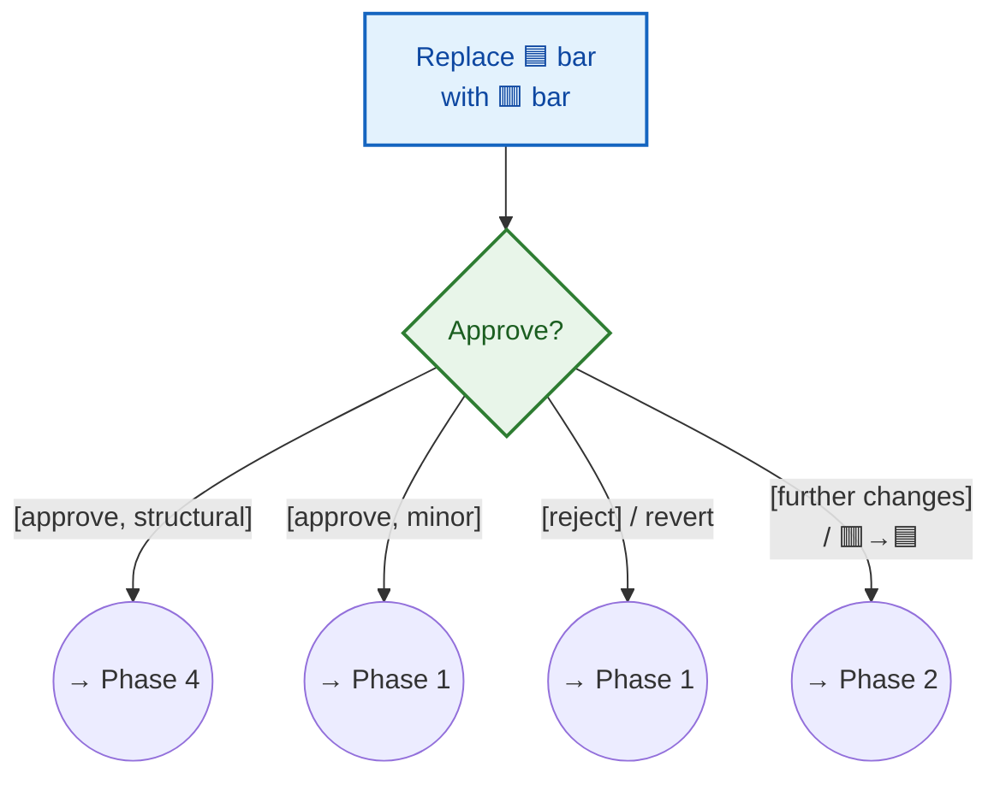
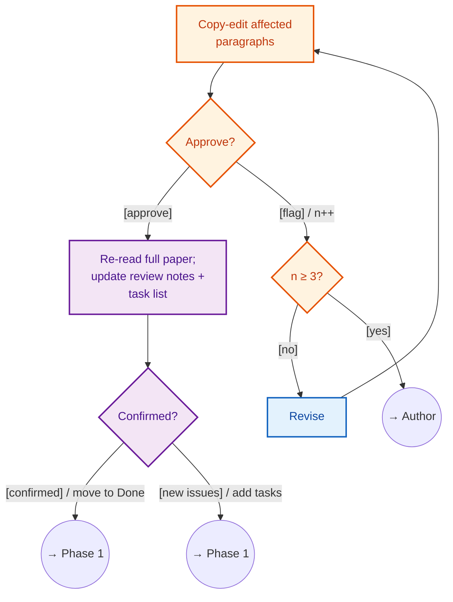

# Paper Authoring Workflow

## Overview

Legend: 🟦 Author-assistant 🟢 Human author. See [phase details](#phase-details) below.

---

## Phase details

### Phase 1 — Task Selection

### Phase 2 — Edit / Dismiss

### Phase 3 — Author Review

### Phase 4 — Structural Close-out

---

**Edge notation:** `[guard] / action`. Build implicit after any document change.

**Status Tracker operations** (all marker/state changes go through Status Tracker):
- **select**: add 🔵 + 🟦 bars
- **expand-scope**: add 🟦 bars around additional passage
- **begin-review**: 🟦→🟥 (Phase 2→3 gate)
- **return-to-edit**: 🟥→🟦 (Phase 3→2 return)
- **complete** / **complete-collaborative**: remove bars, move to Done
- **validate**: check dashboard ↔ `.tex` consistency (session resume)

**Markers:** 🟦 bar = `\selectstart`/`\selectend` (editing precondition). 🟥 bar = `\reviewstart`/`\reviewend` (awaiting approval). Approved markup outside bars is expected.

**Colours:** 🟦 Author-assistant 🟢 Human author 🟧 Copy-editor 🟪 Structure reviewer
